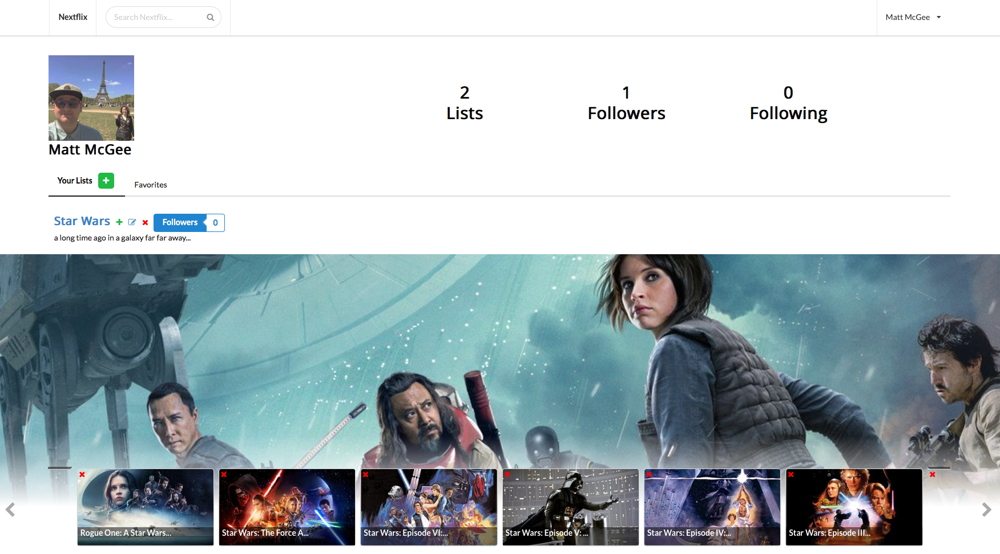
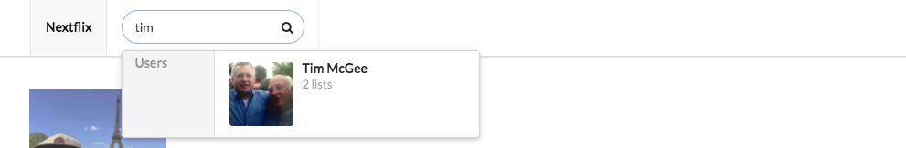

# Nextflix 
### It's hard to keep track of where your favorite movies are being streamed, let Nextflix help. Create lists of your favorite movies, follow other users and their lists, and find out which streaming services are currently showing each movie. Nextflix is also great for adding upcoming releases to get alerted when they are released!  

This project is live on Heroku: http://nextflix-app.herokuapp.com/
___
## On the home profile page view lists that you have created, 

## Favorite lists from other users, 

## And the update feed from users you follow.

## Clicking on a movie will provide info about the film and easy access to where it's streaming or adding the movie to your lists.

## Watch movies instantly by clicking an icon.

## Searching for movies to add to your list is simple.

## Use the global search to find users or lists to follow.

     
